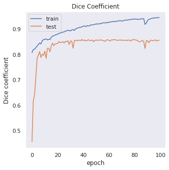
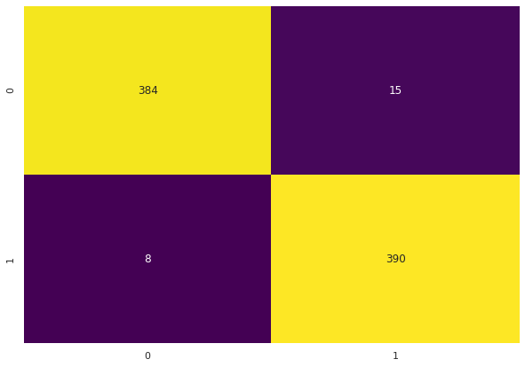

# Segmentation_and_classification_of_Covid-19-lungs-CT-Scan

## Brief Description and Main Features of this Project are -

This Project includes 3 Task :-
##### TASK 1- Covid 19 Infection Segmentation
##### TASK 2- Covid 19 Classification
##### TASK 3- Covid 19 Lung Segmentation


<table border="0">
<tr>
<td><b style="font-size:30px">Sample data</b></td>
</tr>
<tr>
<td></td>
</tr>
</table>


#### --------------------------------------------------------------------------------------------------------------------------------

### Details of the 3 Tasks are:-
In this Project, we have been given 20 3D CT Scans and their Masks. We have taken some 2D slices of the images. <br/>
Before Training the Model for any of the subtasks, we have to do PreProcessing on images, and then this same Preprocessing can be used in tasks and then feed into the model.

- ***Task 1:-***  This Task First do some PreProcessing of the images and then do the Infection Segmentation from the Patient Lungs.The model used for Segmentation is the UNET model.
- ***Task 2:-***  Task 2 contains a Classification model using CNN, which classifies CT Scan as Covid or Non-Covid Person.
- ***Task 3:-***  Task 3 contains the Lung Segmentation from their respective CT scans. Here also for Lung Segmentation, we used the Segmentation model

#### -----------------------------------------------------------------------------------------------------------------------------------------
# Preprocessing Stage

1.) Removing incomplete and fauty images(Removed initial 25% and ending 25% slices from the 3D CT Scans) <br />
2.) For image enhancement we used  Contrast Limited Adaptive Histogram Equalization(CLAHE) method ()<br />
3.) Cropping the Region of Interst (ROI)  <br />
4.) Data Augmentation <br />

###### Faulty and Blurry Images

<br/>

##### After Removing faulty images we get cleared image

<br/>

##### Enhanced CT Scan

<br/>

##### Cropped Lungs

<br/>

<table border="0">
 <tr>
    <td><b style="font-size:30px">Augmentated CT Scans (Task: 1)</b></td>
 </tr>
 <tr>
    <td></td>
 </tr>
</table>

<table border="0">
 <tr>
    <td><b style="font-size:30px">Augmented Infections Masks (Task: 1)</b></td>
 </tr>
 <tr>
    <td></td>
 </tr>
</table>


<table border="0">
 <tr>
    <td><b style="font-size:30px">Augmentated CT Scans (Task: 3)</b></td>
 </tr>
 <tr>
    <td></td>
 </tr>
</table>

<table border="0">
 <tr>
    <td><b style="font-size:30px">Augmented Lung Masks (Task: 3)</b></td>
 </tr>
 <tr>
    <td></td>
 </tr>
</table>

#### -----------------------------------------------------------------------------------------------------------------------------------------

# Results
```
RESULT TABLE
+----------------------------------------+----------------------------+-----------------------+---------------------------+---------------
|                                    |    Dice       |   IOU     |  Precision   |   Recall    |  AUCROC |   F1 Score   | Accuracy |
+----------------------------------------+----------------------------+-----------------------+---------------------------+----------------
| Task1: Infection Segmentation      |    0.867      |  0.765    |    0.861     |   0.873     |    -    | same as dice |     -    |
+----------------------------------------+----------------------------+-----------------------+---------------------------+----------------
|       Task2: Classification        |      -        |     -     |    0.963     |   0.980     |   0.971 |     0.971    |          |
+----------------------------------------+----------------------------+-----------------------+---------------------------+----------------
|       Task3: Lung Segmentation     |  0.978        |    0.958  |     0.977    |    0.980    |    -    | same as dice |     -    |
+----------------------------------------+----------------------------+-----------------------+---------------------------+----------------
|                                        | Note: precision and recall | values are as per the | best threshold for dice   |       |
+--------------------------------------+------------------------+-----------------------------------------+-------------------+------------+
```

# Results with UNet (Task: 1-Infection Segmentation)

<table border="0">
 <tr>
    <td><b style="font-size:30px">Trianing curve for Dice Coefficient</b></td>
    <td><b style="font-size:30px">Training curve for BCE+Dice Loss</b></td>
 </tr>
 <tr>
    <td></td>
    <td></td>
 </tr>
</table>

<table border="0">
 <tr>
    <td><b style="font-size:30px">Optimizing threshold for dice and IOU</b></td>
 </tr>
 <tr>
    <td></td>
    
 </tr>
</table>


<table border="0">
 <tr>
    <td><b style="font-size:30px">Precision and recall curves v/s thresholds</b></td>
 </tr>
 <tr>
    <td></td>
 </tr>
</table>


<table border="0">
 <tr>
    <td><b style="font-size:30px">Some Actual Vs Predicted Masks</b></td>
 </tr>
 <tr>
    <td></td>
 </tr>
</table>

# Results with CNN (Task: 2- Covid 19 Classification)

<table border="0">
 <tr>
    <td><b style="font-size:30px">Classification loss curve</b></td>
 </tr>
 <tr>
    <td></td>
 </tr>
</table>

<table border="0">
 <tr>
    <td><b style="font-size:30px">Confusion matrix </b></td>
 </tr>
 <tr>
    <td></td>
 </tr>
</table>

##### Precision vs Recall


##### ROC Curve


# Results with UNet (Task: 3- Lungs Segmentation)

<table border="0">
 <tr>
    <td><b style="font-size:30px">Training curve for Dice Coefficient</b></td>
    <td><b style="font-size:30px">Training curve for BCE + Dice Loss</b></td>
 </tr>
 <tr>
    <td></td>
    <td></td>
 </tr>
</table>


<table border="0">
 <tr>
    <td><b style="font-size:30px">Optimizing threshold for Dice and IOU</b></td>
 </tr>
 <tr>
    <td></td>
 </tr>
</table>


<table border="0">
 <tr>
    <td><b style="font-size:30px">Actual v/s Predicted Lung Masks</b></td>
 </tr>
 <tr>
    <td></td>
 </tr>
</table>

<table border="0">
 <tr>
    <td><b style="font-size:30px">Precision and recall curves v/s thresholds</b></td>
 </tr>
 <tr>
    <td></td>
 </tr>
</table>

#### -----------------------------------------------------------------------------------------------------------------------------------------

# Tech Stack and Concept Used in the Project

Important tools/libraries used for this task are:
* Numpy, Pandas, Matplotlib, Nibabel, imgaug, sklearn, skimage, TensorFlow, Keras, cv2, SMOTE, PIL, seaborn,segmentation_model(only to calculate precision and recall in Segmentation) & joblib.

* For Segmentation we used the UNET Model to Segment the Infection and Lungs From the given  CT Scan.<br/>
  - The UNet architecture was used for BioMedical Image segmentation. The introduced architecture had two main parts that were contraction and Expansion. The contraction is all about the covenant layers followed by pooling operation. It is used to extract the factors in the image. The second part Expansion, uses transposed convolution to permit localization. It is again an F.C connected layers network.

  - 


* For Classification, we use simple CNN(Convolution Neural Network) architecture to classify an image into covid or Non-Covid.
  
#### ----------------------------------------------------------------------------------------------------------------------------------------

# Thought behind the Project

 * Covid-19 is a once in century thing. We all saw what hardships were faced by different nations while dealing with it.
  We thought of doing this Project because this is a very new disease & we had to work with NIfTY files, which in itself was a task.
  So, this project can help to detect Covid or Non-Covid patients with the help of CT scans and Localized the area of infection in the lungs.


# SETUP STEPS
* This Project contains 3 .ipynb files for 3 individual Tasks
* Any necessary package to be installed is placed on top of each of the three notebooks.
* Notebooks are using kaggle and Colab collectively so will contain some operations  importing data from kaggle to colab needs a unique API key, mounting drive and authentication etc.

### ---------------------------------------------------------------------------------------------------------------------------------------

`
`
